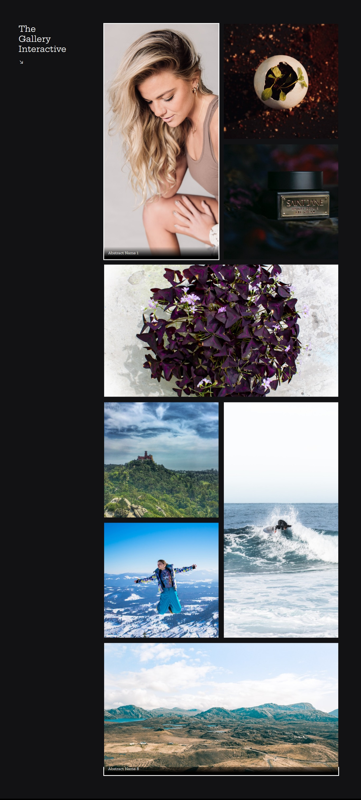
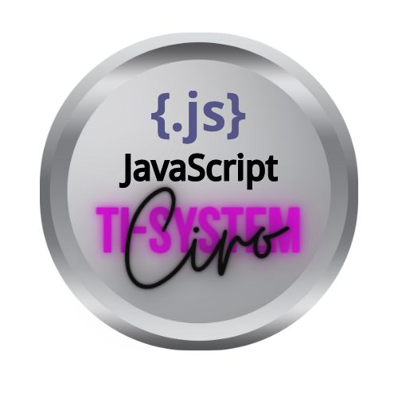

<h1 align="center"> Uma Galeria com <CODE>Hover</CODE> </h1>

⚙️ Desenvolvimento de uma galeria de fotos interativa. ⚙️

 

  

 

## 🚀 Tecnologias

Esse projeto foi desenvolvido com as seguintes tecnologias:

- HTML e CSS
- Phosphor Icons
- Figma
- Picsum API

 

## 🔖 Layout

Você pode visualizar o layout do projeto através [DESSE LINK](https://www.figma.com/community/file/1240650697984569274). É necessário ter conta no [Figma](https://figma.com) para acessá-lo.

 

## 📝 License

  

Esse projeto está sob a licença MIT.

 

### 👨‍💻 Autor

 
 <em>Ciro Batista da Silva<em>
 
  

 
👋🏽 Entre em contato!

 

